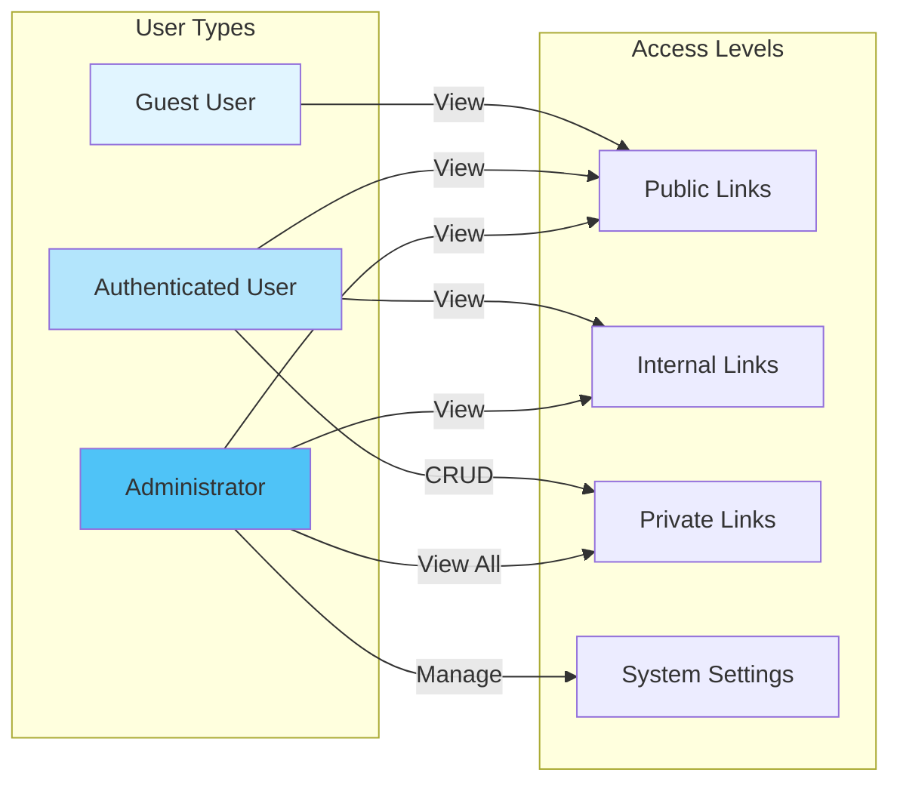
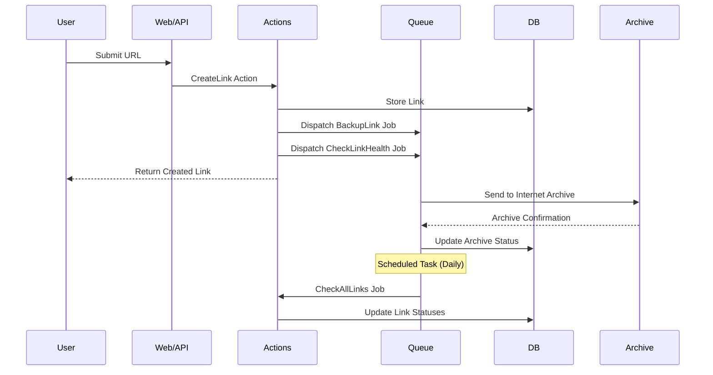
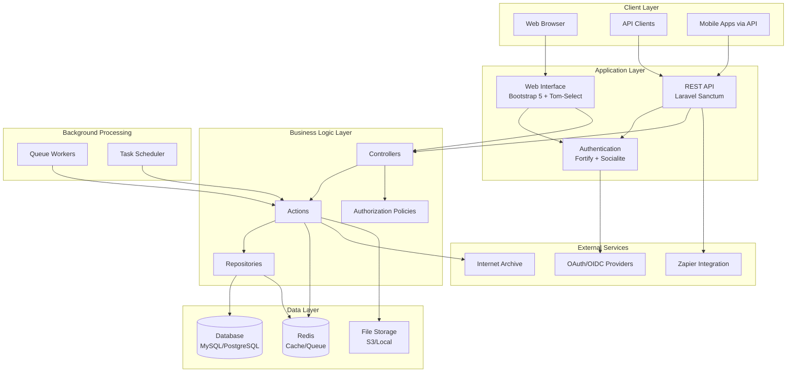

{/* Build timestamp: 1765413354629 - Forces cache invalidation */}

**Last Updated:** 12/11/2025

---

# LinkAce - Engineering Overview

LinkAce is a self-hosted bookmark management application designed to help users archive, organize, and share web links with advanced features beyond traditional browser bookmarks. Built with Laravel (PHP) and modern web technologies, it provides a robust, personalized database for curating and managing online discoveries.

## What Problem Does It Solve?

LinkAce addresses the limitations of browser bookmarks by providing:

Long-term preservation: Automated archiving via Internet Archive prevents link rotAdvanced organization: Multi-dimensional categorization using lists and tagsLink health monitoring: Automated checking for broken or moved linksCollaborative sharing: Multi-user support with internal sharing capabilitiesCross-platform access: Full REST API and integrations with 2500+ apps via ZapierPrivacy control: Granular visibility settings (public, internal, private)

## Intended Users

LinkAce targets several user personas:

Researchers and academics who need to maintain organized reference collectionsProfessionals curating industry resources and knowledge basesTeams and organizations sharing curated link collections internallyPower users who want more control and features than browser bookmarks providePrivacy-conscious individuals seeking self-hosted alternatives to cloud bookmark services

## Main Features & Capabilities

### Core Functionality

Bookmark management with automatic title/description generationOrganization tools: Lists and tags for multi-dimensional categorizationAdvanced search with filters and custom orderingAutomated link monitoring with status notificationsInternet Archive integration for automatic site archivingMulti-user support with role-based permissionsImport/export via HTML bookmark format

### Technical Features

Full REST API (OpenAPI/Swagger documented) for programmatic accessOAuth/OIDC support for SSO (Auth0, Authentik, Keycloak, Azure AD, Okta, etc.)RSS feeds for public and private link collectionsBookmarklet for quick saving from any browserS3-compatible backup support for data protectionLight/dark themes with automatic switchingInternationalization via Crowdin (multiple languages supported)

### Developer Features

Comprehensive API with bulk operations supportZapier integration for workflow automationActivity logging and auditing (via Spatie packages)Soft deletes with trash management

### Bookmark Processing Flow

### Core Functionality

Bookmark management with automatic title/description generationOrganization tools: Lists and tags for multi-dimensional categorizationAdvanced search with filters and custom orderingAutomated link monitoring with status notificationsInternet Archive integration for automatic site archivingMulti-user support with role-based permissionsImport/export via HTML bookmark format

### Technical Features

Full REST API (OpenAPI/Swagger documented) for programmatic accessOAuth/OIDC support for SSO (Auth0, Authentik, Keycloak, Azure AD, Okta, etc.)RSS feeds for public and private link collectionsBookmarklet for quick saving from any browserS3-compatible backup support for data protectionLight/dark themes with automatic switchingInternationalization via Crowdin (multiple languages supported)

### Developer Features

Comprehensive API with bulk operations supportZapier integration for workflow automationActivity logging and auditing (via Spatie packages)Soft deletes with trash management

## High-Level Architecture

LinkAce is a **Laravel 10-based monolithic application** following MVC architecture patterns. The backend uses PHP 8.1+ with a relational database (MySQL/MariaDB or PostgreSQL), Redis for caching/queues, and a modern frontend built with Bootstrap 5 and Tom-Select. The application follows Laravel best practices with dedicated layers for Actions, Repositories, Jobs, and API resources, and ships as Docker containers for simplified deployment.

Key architectural components:
- **Backend**: Laravel 10 framework with PHP 8.1+
- **Database**: MySQL/MariaDB or PostgreSQL support
- **Cache/Queue**: Redis for performance and background jobs
- **Frontend**: Bootstrap 5 + Tom-Select (server-side rendering)
- **API**: RESTful API with Laravel Sanctum authentication
- **Deployment**: Docker-based with multi-architecture support (amd64, arm64, arm/v7)

## Project Maturity & Stability

### Maturity Indicators

Production-Ready (v2.x): LinkAce recently released version 2.0, indicating a major milestone in maturity. Current version is 2.4.1.

Well-Structured Codebase:

Comprehensive test suite with PHPUnitCode quality monitoring via CodacyStandardized code style (PHP_CodeSniffer)Clear separation of concerns (Actions, Repositories, Policies)Dependency management via Composer and NPM

Enterprise-Grade Features:

Security advisories monitoring (Roave)Error tracking integration (Sentry)Comprehensive audit loggingDatabase backup strategiesMulti-database support

Active Development:

Regular releases tracked on GitHubCommunity discussions forumCrowdin for translations (community-driven)Open Collective/Patreon support modelComprehensive documentation site

Deployment Options:

Docker Compose (production and development)Native PHP installationKubernetes support (Beta)One-click cloud deploymentsManaged hosting (Beta waitlist)

### Areas to Note

Version 2.0 is recent: While feature-rich, the v2.x branch represents a significant upgrade from v1.x. Teams should review the upgrade guide and test thoroughly.Community support model: Free support is community-driven via GitHub Discussions; dedicated support requires sponsorship.Kubernetes support is Beta: Production Kubernetes deployments should be evaluated carefully.

## Getting Started

For new engineers joining the project:

Setup: Review the Setup with Docker guide in the official documentationArchitecture: See the Architecture page for detailed component breakdownContributing: Read CONTRIBUTING.md for development workflow and guidelinesAPI: Explore openapi.json for complete API documentationTesting: Run test suite with composer run test and linting with composer run lint

## Technology Stack Summary

| Layer | Technology |
|-------|-----------|
| Backend Framework | Laravel 10 |
| Language | PHP 8.1+ |
| Database | MySQL/MariaDB, PostgreSQL |
| Cache/Queue | Redis |
| Frontend | Bootstrap 5, Tom-Select |
| Build Tools | Laravel Mix, Webpack, Sass |
| API | REST (Laravel Sanctum) |
| Testing | PHPUnit |
| Containerization | Docker, Docker Compose |
| Authentication | Laravel Fortify, Socialite (OAuth/OIDC) |

## Key Dependencies

Laravel Packages: Fortify (auth), Sanctum (API tokens), Socialite (OAuth)Spatie Packages: Activity Log, Backup, Permissions, SettingsHTML Parsing: Masterminds HTML5, DOMDocumentHTTP Client: GuzzleFile Storage: Flysystem (S3, FTP, SFTP support)Monitoring: Sentry, Laravel Ray (dev)

## Resources

Official Website: linkace.orgDocumentation: linkace.org/docs/v2Demo: demo.linkace.orgGitHub: github.com/Kovah/LinkAceCommunity: GitHub DiscussionsTranslations: Crowdin Project